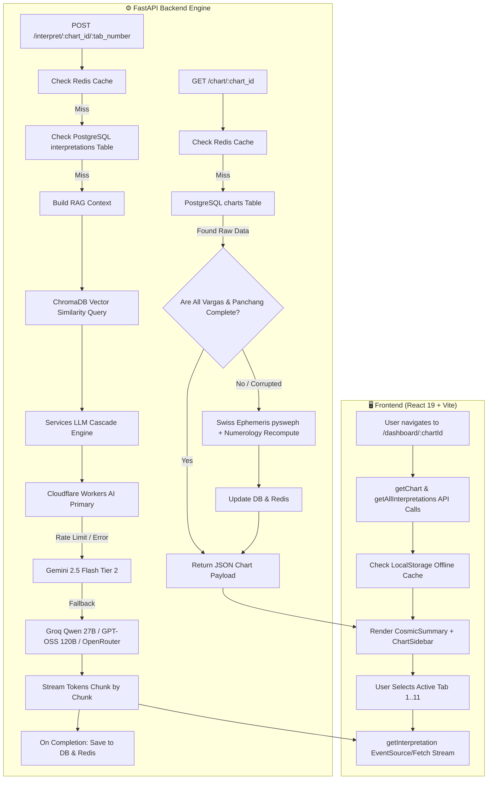

# 🌌 Complete Architectural Specification: Trikal Darshi Dashboard

Comprehensive end-to-end breakdown of the **Trikal Darshi Dashboard** (`/dashboard/:chartId`): spanning data origin, backend orchestration, RAG & LLM cascade processing, frontend component tree, design tokens, typography, visual hierarchy, interpretation rendering engine, and scroll-locking mechanics.

---

## 1. 🔄 Complete End-to-End Data Flow



---

## 2. 🧬 Backend Architecture & Processing Pipeline

### 2.1 Birth Chart Retrieval & Ephemeris Calculations (`/chart/{chart_id}`)
1. **Endpoint**: `GET /chart/{chart_id}` (in [`routes/chart.py`](file:///d:/AstrologyApp/astrology-backend/routes/chart.py))
2. **Layer 1 - In-Memory Cache (Redis)**: Checks key `chart:{chart_id}` for cached JSON.
3. **Layer 2 - Persistent Store (PostgreSQL)**: Queries `charts` table for `raw_chart_data`, `full_name`, `date_of_birth`, `time_of_birth`, coordinates, and language.
4. **Layer 3 - Dynamic Repair & Harmonic Ephemeris Engine (`ensure_chart_complete`)**:
   - If raw planetary data is missing or corrupted, the backend re-invokes `get_complete_chart()` with the user's birth coordinates via Swiss Ephemeris (`pysweph`).
   - Computes:
     - **Lagna (D1)**: Exact ascendant degree and nakshatra pada.
     - **Divisional Charts (Vargas)**:
       - **D9 Navamsha** (Spouse, inner potential, 9th harmonic).
       - **D10 Dashamsha** (Vocation, authority, 10th harmonic).
       - **D4 Chaturthamsa** (Fixed assets, property, 4th harmonic).
       - **D7 Saptamsha** (Lineage, progeny, 7th harmonic).
       - **D30 Trimsamsa** (Afflictions, subtle imbalances, 30th harmonic).
       - **Chandra Kundali** (Moon-centric house realignment).
       - **Surya Kundali** (Sun-centric house realignment).
     - **Panchanga & Astro Details**: Tithi, Yoga, Karan, Vashya, Gana, Nadi, Varna, Yoni.
     - **Dosha Analysis**: Mangal Dosha (houses 1, 4, 7, 8, 12), Kaal Sarp Dosha, Pitru Dosha, and Gand Mool nakshatra status.
     - **Vimshottari Dasha Windows**: Mahadasha, Antardasha, start/end dates, and percentage progress.
     - **Anka Shastra (Numerology)**: Moolank (root), Bhagyank (destiny), and Namank (name vibration) with ruling planetary lords.
5. **Background Task**: Triggers `pregenerate_all_tabs()` to warm interpretations in the background while the user views the initial tab.

### 2.2 Streaming AI Interpretation Engine (`/interpret/{chart_id}/{tab_number}`)
1. **Endpoint**: `POST /interpret/{chart_id}/{tab_number}` (in [`routes/interpret.py`](file:///d:/AstrologyApp/astrology-backend/routes/interpret.py))
2. **Tab Routing**: Maps tab numbers `1..11` to their respective classical chapters:
   - **Tab 1**: Lagna & Soul Blueprint
   - **Tab 2**: Lal Kitab Karmic Debts & Rina
   - **Tab 3**: Numerology Matrix (Moolank & Bhagyank)
   - **Tab 4**: Career & Dashamsha D10 Exegesis
   - **Tab 5**: Wealth, Fixed Assets & Chaturthamsa D4
   - **Tab 6**: Love, Marriage & Navamsha D9
   - **Tab 7**: Health, Vitality & Trimsamsa D30
   - **Tab 8**: Remedies Tripath System (Vedic, Lal Kitab, Numerology)
   - **Tab 9**: Progeny Lineage & Saptamsha D7
   - **Tab 10**: Gochar Current Planetary Transits
   - **Tab 11**: Education, Academic Trajectory & Intellect
3. **Retrieval-Augmented Generation (RAG)**:
   - Queries ChromaDB vector embeddings stored in `chroma_db/` indexed from classical texts (*Brihat Parashara Hora Shastra*, *Phaladeepika*, *Brihat Jataka*, *Lal Kitab*).
4. **Unified LLM Cascade**:
   - **Tier 1**: Cloudflare Workers AI (`@cf/meta/llama-3.3-70b-instruct-fp8-fast`, or `@cf/deepseek-ai/deepseek-r1-distill-qwen-32b` for Hindi/Bengali).
   - **Tier 2**: Google Gemini 2.5 Flash.
   - **Tier 3**: Groq Qwen3 27B (`qwen/qwen3.8-27b`, hidden reasoning).
   - **Tier 4**: Groq GPT-OSS 120B (`openai/gpt-oss-120b`).
   - **Tier 5**: OpenRouter Free Safety Net (`qwen/qwen3.8-27b:free`).
   - **Tier 6**: Groq GPT-OSS 20B (`openai/gpt-oss-20b`).
5. **Validation & Streaming**:
   - Enforces minimum chapter length (>= 1,000 characters) to ensure deep, scholarly exegesis.
   - Streams text via chunked HTTP `StreamingResponse` to the client.
   - On completion, writes full narrative into PostgreSQL `interpretations` table and caches in Redis.

---

## 3. 🎨 Design Theme, Color System & Typography

### 3.1 Active Theme: `theme-vedic-gold` (Manuscript & Temple Parchment)
The visual identity is modeled on traditional Indian palm-leaf and royal manuscript folios (*Pothi* / *Grantha*), avoiding dark neon cyber-astrology tropes in favor of an authentic, regal aesthetic.

| Token | Hex Value | Semantic Role in Dashboard |
| :--- | :--- | :--- |
| `--color-background` | `#FBF6EA` | Warm hand-pressed parchment page background |
| `--color-surface` | `#FBF6EA` | Container baseline |
| `--color-surface-bright` | `#FFFDF6` | Elevated manuscript card surfaces (Cards, Panels, Header) |
| `--color-surface-container-low` | `#FAF5E8` | Secondary sub-cards and toggle bars |
| `--color-primary` | `#022454` | Midnight Temple Indigo: Headings, brand title, major icons |
| `--color-primary-container` | `#1F3A6B` | Deep Indigo Wash: Selected buttons, active chips, CTA borders |
| `--color-secondary` | `#7b5800` | Antiqued Ochre/Gold: Subtitles, folio tags, planetary keys |
| `--color-secondary-gold` | `#D9A63C` | Radiant Vedic Gold: Active indicators, star glyphs, corner flourishes |
| `--color-outline-variant` | `#E8D5A7` | Warm Golden Sand: Borders, dividers, Kundali grid lines |
| `--color-on-surface` | `#0E1A37` | High-contrast Charcoal Indigo for reading body prose |
| `--color-on-surface-variant`| `#4A567A` | Muted slate-indigo for secondary labels, degree timestamps |
| `--color-error` | `#BA1A1A` | Classical crimson for debilitated planets and alert doshas |

### 3.2 Typography Stack
- **Headings & Manuscript Display (`font-['Fraunces',serif]`)**:
  - `Fraunces` with fallbacks to `Noto Serif Devanagari` and `Noto Serif Bengali`.
  - Used on: Brand header, chapter titles, varga names, modal titles.
- **Data, Navigation & Body Prose (`font-body-md` / `Inter`)**:
  - `Inter` with fallbacks to `Noto Sans Devanagari` and `Noto Sans Bengali`.
  - High legibility across English, Hindi, and Bengali scripts.
- **Accents & Sanskrit Terms**:
  - `Crimson Text` / Italicized serifs for classical blockquotes, Vedic mantras, and Sanskrit planetary abbreviations (`Su`, `Ch`, `Ma`, `Bu`, `Gu`, `Sk`, `Sa`, `Ra`, `Ke`).

---

## 4. 📐 Detailed Layout Structure & Visual Hierarchy

The dashboard layout is divided into 4 stacked visual zones within a max-width container (`max-w-[1440px]`):

```
+-----------------------------------------------------------------------------------------+
| [STICKY TOP HEADER (h-16)]                                                              |
| [✦ TRIKAL DARSHI]          [Pre-Gen Progress Pill]   [Ask AI]  [Profile]  [Avatar/Drawer]|
+-----------------------------------------------------------------------------------------+
| [ZONE 1: UPPER OBSERVATORY DECK (Side-by-Side 7:5 Grid)]                                |
| +-----------------------------------------------+ +-----------------------------------+ |
| | CosmicSummary (7 Cols)                        | | ChartSidebar (5 Cols)             | |
| | • Golden Corner Sheen & Accents               | | • Varga Selector (9 Toggles)      | |
| | • Header: Native Name + DOB/TOB + Coordinates | | • North Indian SVG Chart (340px)  | |
| | • 20 Ephemeris Chips (Lagna, Moon, Dasha,     | | • House & Planet Glyphs           | |
| |   Doshas, Panchanga, Numerology)              | | • Ayanamsha & House System Footer | |
| | • Vimshottari Timeline Strip                  | | • Action Bar: Fullscreen / Edit   | |
| +-----------------------------------------------+ +-----------------------------------+ |
+-----------------------------------------------------------------------------------------+
| [ZONE 2: STICKY SUB-NAVIGATION TAB BAR (top-16)]                                        |
| [1. Lagna] [2. Lal Kitab] [3. Numerology] [4. Career] ... [11. Education] [Export Doc] |
+-----------------------------------------------------------------------------------------+
| [ZONE 3: READING EXEGESIS PANEL (Seamless Scroll-Locked Viewport)]                      |
| • Manuscript Folio Tag & Chapter Subtitle                                               |
| • AI Markdown Stream / Formatted Tables / Blockquotes / Remedy Tripath Cards            |
| • Classical Ephemeris Facts Fallback Card (if offline or streaming)                     |
+-----------------------------------------------------------------------------------------+
| [ZONE 4: FOOTER] Disclaimer, Copyright & Cultural Heritage Attributions                 |
+-----------------------------------------------------------------------------------------+
```

---

## 5. 🧩 Component-by-Component Blueprint

### 5.1 Sticky Top Header (`<header>`)
- **Placement**: Pinned to viewport top (`sticky top-0 z-50`).
- **Surface**: `#FFFDF6` at 95% opacity with `backdrop-blur-md` and `#E8D5A7` bottom border.
- **Left Element**: Logo square badge with gold star glyph `✦`, **TRIKAL DARSHI** title, and *"11 Soul Dimensions"* subtitle.
- **Center-Right**:
  - **Pre-generation progress pill**: Shows live pulsing gold dot, number of ready chapters, and mini progress bar. Transitions to *"All 11 Chapters Ready"* upon completion.
- **Right Action Cluster**:
  - **"Ask AI Jyotishi" Button**: Midnight indigo button with gold star icon, linking to `/chat/:chartId`.
  - **Profile Icon Button**: Navigates to `/profile`.
  - **Logout Icon Button**: Logs out user.
  - **Drawer Trigger Avatar**: Shows native's uppercase initials (`getInitials`), full name, and burger menu icon.

### 5.2 Upper Observatory Zone: CosmicSummary (`<CosmicSummary />`)
- **Placement**: Left column (`lg:col-span-7`) of the upper observatory deck.
- **Visuals**: Decorated with 4 corner gold brackets (`#D9A63C`), a radial gold ambient background glow, and an antiqued border.
- **Grid of 20 Astrological Metric Chips**:
  1. **Lagna**: Sign, exact degree/arcminutes, and nakshatra.
  2. **Chandra Rashi**: Moon sign, nakshatra, and pada.
  3. **Atmakaraka**: Highest degree planet (excluding Rahu/Ketu).
  4. **Active Dasha**: Current Mahadasha & Antardasha with completion dates.
  5. **Moolank (Numerology)**: Root birth date vibration and ruler.
  6. **Bhagyank (Numerology)**: Full destiny date sum and ruler.
  7. **Namank (Numerology)**: Full name vibration number and ruler.
  8. **Tithi**: Precise lunar phase from Panchang.
  9. **Yoga**: Auspicious/inauspicious Panchanga yoga.
  10. **Karan**: Half-tithi ruler.
  11. **Vashya**: Vedic animal/human behavioral classification.
  12. **Nakshatra Lord**: Ruling planetary graha of the birth star.
  13. **Gana**: Deva, Manushya, or Rakshasa temperament.
  14. **Nadi**: Vata, Pitta, or Kapha doshic channel.
  15. **Varna**: Classical sociological archetype.
  16. **Yoni**: Instinctual animal totem.
  17. **Mangal Dosha**: Mars affliction status and house placement (1, 4, 7, 8, 12).
  18. **Kaal Sarp Dosha**: Nodal entrapment classification.
  19. **Pitru Dosha**: Ancestral karmic indicator.
  20. **Gand Mool**: Junction nakshatra status.
- **Dasha Timeline Bar**: Horizontal visual progress bar displaying elapsed versus remaining time in the active Mahadasha.

### 5.3 Upper Observatory Zone: ChartSidebar (`<ChartSidebar />`)
- **Placement**: Right column (`lg:col-span-5`) of the upper observatory deck.
- **9-Varga Quick Selector**:
  - 5-column compact toggle grid for: **D1** (Lagna), **D9** (Navamsha), **D10** (Dashamsha), **D4** (Chaturthamsa), **D7** (Saptamsha), **D30** (Trimsamsa), **Chandra** (Moon chart), **Surya** (Sun chart), and **Gochar** (Live transit overlay).
  - Automatically synchronizes with the active reading tab (e.g., selecting Tab 4 defaults to D10; Tab 6 defaults to D9).
- **North Indian Kundali Diamond Grid (`<DivisionalChart />`)**:
  - 400×400 responsive SVG container rendered inside a parchment-framed box (`max-w-[340px]`).
  - Renders 12 diamond/triangular houses with dynamic house coordinate centers.
  - Plots Sanskrit planetary abbreviations with color-coded dignities:
    - **Exalted (Ex)**: Deep Ochre Gold (`#7b5800`).
    - **Debilitated (Deb)**: Crimson Red (`#BA1A1A`).
    - **Own Sign (Own)**: Royal Navy (`#1F3A6B`).
    - **Retrograde (R)**: Slate Muted Indigo with `(R)` indicator.
- **Metadata Strip**: Confirms **Lahiri Ayanamsha (24°11'42")** and Whole Sign / Vedic house system.
- **Action Triggers**: "Edit Details" modal button to update birth parameters.

### 5.4 Sticky Sub-Navigation Tab Bar (`<TabNavigation />`)
- **Placement**: `sticky top-16 z-40`, floating directly beneath the main header on scroll.
- **Scrollable Pill Container**: Horizontal bar listing all 11 dimension tabs + the **Full Vedic Report** master folio.
- **Visual Indicators**:
  - **Active Tab**: Filled navy background (`#1F3A6B`), gold outline, glowing gold beacon dot, and golden "ACTIVE" tag.
  - **Streaming/Generating Tab**: Pulsing radar ring.
  - **Loaded/Completed Tab**: Emerald green status dot (`#1E6E3E`).
- **Export Action**: Right-aligned button that renders and triggers download of a standalone, print-ready HTML dossier.

---

## 6. 📜 The Interpretation Engine & Formatting Specs

Raw markdown streamed from the LLM cascade is processed through [`formatters.jsx`](file:///d:/AstrologyApp/astrology-frontend/src/components/formatters.jsx), converting markdown constructs into styled editorial elements:

### 6.1 Typography & Content Formats
- **LaTeX Math Sanitization (`cleanLaTeX`)**:
  - Converts raw formulas (`\rightarrow`, `\times`, `\mathbf`, `$\approx$`) into clean Unicode characters (`→`, `×`, `≈`, bold text).
- **Section Headers (`.prose-section-header`)**:
  - Triggered by `## / ###`, `A) Title`, or `ALL CAPS:` lines.
  - Rendered in bold `Fraunces` serif, uppercase, with a subtle golden bottom hairline border.
- **Key-Value Pairs (`.prose-key`)**:
  - Triggered by lines matching `KEY: Value`.
  - Keys are styled in uppercase Ochre Gold (`#7c5800`), bold font, followed by clean dark indigo prose.
- **Markdown Tables (`.prose-table-wrapper` & `.prose-table`)**:
  - Table lines starting with `|` are rendered into an editorial responsive table.
  - Header cells have a parchment background, navy borders, and uppercase typography.
- **Callouts & Blockquotes (`.prose-blockquote`)**:
  - Lines prefixed with `>` or surrounded by quotes.
  - Rendered with a 3px Vedic Gold left border, parchment background, and italicized serif font.
- **Bullet & Numbered Lists**:
  - Top-level bullets receive a golden star glyph (`✦`).
  - Sub-bullets receive a diamond glyph (`◇`).
  - Numbered items use a serif numeral styled in bold gold.

### 6.2 Tab 8: Tripath Remedial System (`<RemedyCards />`)
On Tab 8, the layout transforms the text into three parallel thematic cards:
1. **Track 1: Vedic Shanti & Daiva Vyapashraya**:
   - Mantras, Graha Shanti rituals, deity propitiations, gemstone guidelines, and sacred charity (*Dāna*).
2. **Track 2: Lal Kitab Upaya & Karmic Debts**:
   - Environmental corrections, river immersion rituals, copper coin practices, and ancestral debt (*Rina*) clearances.
3. **Track 3: Practical & Vibrational Numerology**:
   - Color therapy, lucky directional alignment, name vibration balancing, and daily behavioral habits.

### 6.3 Fail-Safe Classical Facts Card (`<ClassicalFactsCard />`)
- **Behavior**: If the network drops, LLM quotas are exhausted, or an interpretation is still generating, the dashboard never displays an empty screen.
- **Mechanism**: Immediately renders pure astronomical data computed directly from the Swiss Ephemeris (`Lagna`, `Moon sign & nakshatra`, `Current Dasha`, and `Kuja Dosha check`) with a note: *"Computed by Swiss Ephemeris · no AI"*.

---

## 7. 🔒 Seamless Sticky Scroll-Lock Mechanism

To provide an optimal reading experience where neither the chart observatory nor the long reading chapter is lost:

1. **Header Pinned**:
   - Top Header remains at `top: 0` (`h-16` / 64px, `z-index: 50`).
2. **Sub-Nav Pinned**:
   - Tab navigation bar remains pinned at `top: 64px` (`top-16`, `z-index: 40`).
3. **Dynamic Viewport Height Calculation**:
   - The reading scroll panel is styled with:
     ```css
     height: calc(100vh - 64px - ${tabNavHeight}px);
     overscroll-behavior: contain;
     scroll-behavior: smooth;
     overflow-y: auto;
     ```
   - A `ResizeObserver` on `tabNavRef` continuously measures the exact height of the tab navigation bar (`tabNavHeight`, ~53px).
   - This ensures the prose reading card fills **100% of the remaining screen space** without double scrollbars on the window.
4. **Independent Scrolling**:
   - The user scrolls through thousands of words of astrological exegesis within the reading card while the top navigation and upper observatory remain accessible.
   - When the user switches tabs, `contentScrollRef.current.scrollTop = 0` automatically resets the reading pane to the beginning of the new chapter.
