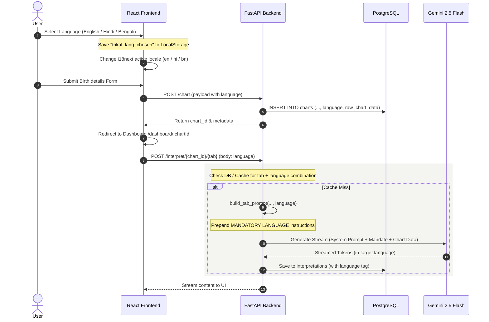

# Trikal Darshi Language Selection Feature Guide

This guide details how the multi-language localization feature is built, wired, and executed across the frontend and backend of the **Trikal Darshi** application.

---

## 1. Overall System Architecture

The language configuration flow spans four layers:
1. **Onboarding/Selection (Frontend)**: Custom welcome modal or dropdown picker.
2. **Persistence (Local Storage & DB)**: Storing preferences locally and in the PostgreSQL database.
3. **Chart Calculation API (FastAPI)**: Sending the selected language during chart generation.
4. **AI Generation Pipeline (RAG & Gemini)**: Enforcing output translations and translating header structures dynamically.



---

## 2. Frontend Workings (React)

### A. Localization Framework: `i18next`
We use `react-i18next` for UI localization. The configuration is defined in [i18n.js](file:///d:/AstrologyApp/astrology-frontend/src/i18n.js). It maps locale files:
* **English**: [en.json](file:///d:/AstrologyApp/astrology-frontend/src/locales/en.json)
* **Hindi**: [hi.json](file:///d:/AstrologyApp/astrology-frontend/src/locales/hi.json)
* **Bengali**: [bn.json](file:///d:/AstrologyApp/astrology-frontend/src/locales/bn.json)

It exports two mapper utilities to convert between backend language names and i18n locales:
```javascript
export function backendLangToI18n(lang) {
  const map = { english: 'en', hindi: 'hi', bengali: 'bn' };
  return map[lang?.toLowerCase()] || 'en';
}

export function i18nLangToBackend(code) {
  const map = { en: 'english', hi: 'hindi', bn: 'bengali' };
  return map[code] || 'english';
}
```

### B. Language Selection Components
1. **[LanguageWelcomeModal.jsx](file:///d:/AstrologyApp/astrology-frontend/src/components/LanguageWelcomeModal.jsx)**:
   * Displays on the user's first-ever visit (checked via `localStorage.getItem('trikal_lang_chosen')`).
   * Designed with a Vedic light theme matching the app.
   * On hover/click, it calls `i18n.changeLanguage()` so the user gets an instant preview of the site's UI language.
   * Saving saves the selection to `localStorage` as `trikal_lang_chosen`.
2. **[LanguageSelect.jsx](file:///d:/AstrologyApp/astrology-frontend/src/components/LanguageSelect.jsx)**:
   * The custom dropdown picker shown inside the birth details forms on the landing page and dashboard edit modal.

### C. State Synchronization (Landing Page & Dashboard)
To prevent the application from reverting to English, state listeners sync selection changes:
* **[HomePage.jsx](file:///d:/AstrologyApp/astrology-frontend/src/pages/HomePage.jsx)**:
  ```javascript
  useEffect(() => {
    const activeI18n = i18n.language || 'en';
    const backendLangMap = { en: 'english', hi: 'hindi', bn: 'bengali' };
    const resolvedLang = backendLangMap[activeI18n] || 'english';
    setFormData((prev) => ({ ...prev, language: resolvedLang }));
  }, [i18n.language]);
  ```
  This ensures that when a user selects a language in the welcome popup modal, the main birth details form's `language` payload updates automatically.
* **[DashboardPage.jsx](file:///d:/AstrologyApp/astrology-frontend/src/pages/DashboardPage.jsx)**:
  * When fetching chart data on mount, the dashboard reads the chart's saved language and updates the active UI locale:
    ```javascript
    const chartLang = data?.language || 'english';
    i18n.changeLanguage(backendLangToI18n(chartLang));
    ```
  * In the profile edit drawer, if the user alters the language, the dropdown updates the local state and saves the choice to `localStorage`.

---

## 3. Backend Workings (FastAPI)

### A. Database Model & Schema
Language preferences are stored on the parent chart row and the generated interpretations:
* **`charts` table**: Has a `language` column (defaults to `'english'`) indicating what language this chart's predictions are tied to.
* **`interpretations` table**: Uses a composite unique constraint `UNIQUE(chart_id, tab_number, language)` to save separate generated predictions for the same chart in different languages.

### B. Tab Predictions Endpoint: `POST /interpret/{chart_id}/{tab_number}`
Located in [interpret.py](file:///d:/AstrologyApp/astrology-backend/routes/chart.py):
1. Reads `language` from the request body JSON (defaults to `'english'`).
2. Queries the cache (Redis) and DB for an existing interpretation matching the chart, tab number, and language:
   ```sql
   SELECT content FROM interpretations 
   WHERE chart_id = $1 AND tab_number = $2 AND language = $3
   ```
3. If found, returns the cached text stream immediately.
4. If not found, invokes the AI Generation Pipeline.

---

## 4. AI Generation & Prompt Engineering

Located in [ai.py](file:///d:/AstrologyApp/astrology-backend/services/ai.py), [ai_prompts.py](file:///d:/AstrologyApp/astrology-backend/services/ai_prompts.py), and [pipeline.py](file:///d:/AstrologyApp/astrology-backend/rag/pipeline.py).

When generating predictions:
1. **User Prompt Language Mandate**:
   At the very top of the prompt built by `build_tab_prompt(..., language)`, the backend prepends a mandatory translation instruction card. It injects translation examples depending on whether Hindi or Bengali is selected:
   ```python
   # Inside services/ai_prompts.py
   "- 'Raj Yogas & Dhana Yogas' -> 'राज योग और धन योग'"
   ```
2. **System Prompt Language Override**:
   Inside `pipeline.py`, the backend checks the requested language. If it is non-English, it appends a system-level instruction block to the master `SYSTEM_PROMPT`:
   ```python
   active_system_prompt = SYSTEM_PROMPT + f"\n\n⚡ CRITICAL OUTPUT LANGUAGE: {language.upper()}..."
   ```
   This ensures the AI models (Gemini 2.5 Flash) receive consistent instruction at both the system role level and user task level.
3. **Phonetic Preservation**:
   The prompt specifically mandates preserving Vedic technical terms (like *Lagna*, *Mahadasha*, *Nakshatra*) in their phonetically written English forms (or translated into target-script phonetics) so that the astrological meaning is not lost in literal translations.
